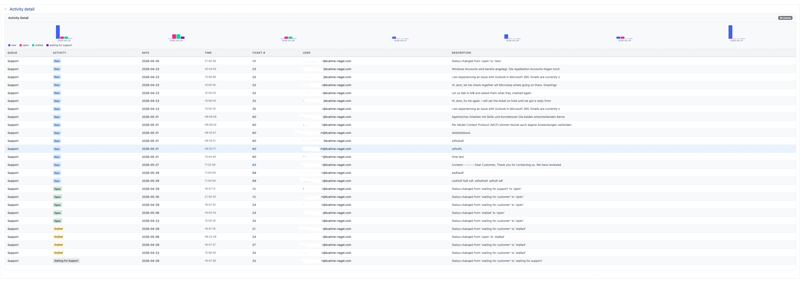

# RT-Extension-ActivityReports

Activity and performance reports for Request Tracker 6, with a fully modernised UI.

## Reports

| Report | Description |
|---|---|
| **Activity Detail** | Chronological log of all ticket events (status changes, comments, correspondence) for a time range, filterable by user |
| **Activity Summary** | Per-queue count of events grouped by status — quick overview of what happened where |
| **Resolution Comments** | Resolved tickets with creation date, resolution date, time to resolve, and whiteboard content |
| **Resolution Statistics** | Average resolution time per queue across multiple periods (date range, last 30/60/90 days, all time) |
| **Time Worked Statistics** | Per-user effort breakdown: resolutions within 24h / 24–48h / 48h+, time worked, and average metrics |

All reports support filtering by:
- Arbitrary RT search query
- Date range (Start / End)
- Specific user (Actor)

Reports are available at `/Reports/Activity/index.html` and also appear as an **Activity Reports** tab on Search Results pages.

## What's new in 2.01

The original extension was functionally complete but visually dated. Version 2.01 is a full UI redesign:

- **Modern table styling** — striped rows, hover highlighting, responsive scrolling, proper thead/tfoot separation
- **Status badges** — colour-coded labels for `new`, `open`, `resolved`, `rejected`, `stalled`, `comment`, etc.
- **Clickable ticket links** throughout all reports
- **Card layout** — each report section is wrapped in a card with a title and event counter
- **Redesigned MiniPlot** — CSS bar chart with hover tooltips showing exact values and a modern colour palette
- **WorkedStatistics split** into three separate cards: Queue Resolution, User Performance, and Still Open tickets
- **ResolutionStatistics** shows `—` instead of empty cells; grouped column headers

## Screenshots

### Activity Detail

The main activity log with colour-coded status badges and live ticket links:



### MiniPlot bar chart

The bar chart at the top of each report shows the distribution at a glance.
Hover over any bar to see the exact value.

## Installation

```bash
perl Makefile.PL
make
sudo make install
```

Add to `/opt/rt6/etc/RT_SiteConfig.pm`:

```perl
Plugin('RT::Extension::ActivityReports');
```

Clear the Mason cache and restart Apache:

```bash
sudo rm -rf /opt/rt6/var/mason_data/obj/*
sudo service apache2 restart
```

## Requirements

- RT 6.0.0 or later
- Bootstrap 5 (bundled with RT 6)

## Author

Originally by Best Practical Solutions, LLC.  
UI redesign by Torsten Brumm <github@picturepunxx.de>.

## License

GNU General Public License, Version 2
